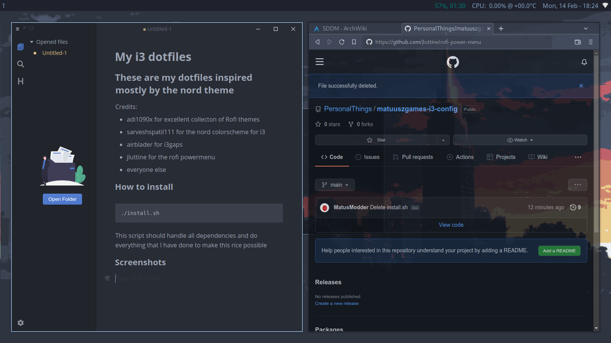

# My i3 dotfiles

## These are my dotfiles inspired mostly by the nord theme

Credits:

- adi1090x for excellent collecton of Rofi themes

- sarveshspatil111 for the nord colorscheme for i3

- airblader for i3gaps

- jluttine for the rofi powermenu

- everyone else

### How to install

```shell
./install.sh
```

This script should handle all dependencies and do everything that I have done to make this rice possible

### Screenshots





